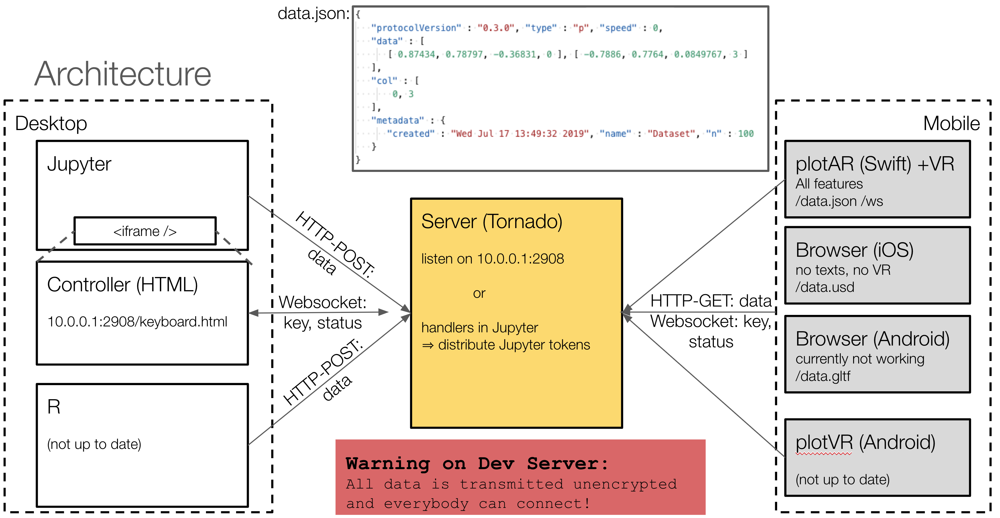

# PlotAR - Walk Through Your Data

[](https://mybinder.org/v2/gh/thomann/plotAR/binder)

| Example | Screenshot | iOS (usdz) <br> Android (gltf)|
| :---         |     :---:        |     :---      |
| **iris**<br>The famous data set |  | <a rel="ar" href="https://thomann.github.io/plotAR/examples/iris.usdz"> iris.usdz</a><br><a href="intent://arvr.google.com/scene-viewer/1.0?file=https://thomann.github.io/plotAR/examples/iris.gltf?mode=ar_preferred#Intent;scheme=https;package=com.google.android.googlequicksearchbox;action=android.intent.action.VIEW;S.browser_fallback_url=https://thomann.github.io/plotAR/;end;"> iris.gltf</a>   |
| **gapminder**<br>Only European countries |  | <a rel="ar" href="https://thomann.github.io/plotAR/examples/gapminder.usdz"> gapminder.usdz</a><br><a href="intent://arvr.google.com/scene-viewer/1.0?file=https://thomann.github.io/plotAR/examples/gapminder.gltf?mode=ar_preferred#Intent;scheme=https;package=com.google.android.googlequicksearchbox;action=android.intent.action.VIEW;S.browser_fallback_url=https://thomann.github.io/plotAR/;end;"> gapminder.gltf</a>   |
| **PLZ**<br>Can you guess what it is? |  | <a rel="ar" href="https://thomann.github.io/plotAR/examples/PLZ.usdz"> PLZ.usdz</a><br><a href="intent://arvr.google.com/scene-viewer/1.0?file=https://thomann.github.io/plotAR/examples/PLZ.gltf?mode=ar_preferred#Intent;scheme=https;package=com.google.android.googlequicksearchbox;action=android.intent.action.VIEW;S.browser_fallback_url=https://thomann.github.io/plotAR/;end;"> PLZ.gltf</a>   |
| **planets**<br>Planets |  | <a rel="ar" href="https://thomann.github.io/plotAR/examples/planets.usdz"> planets.usdz</a><br><a href="intent://arvr.google.com/scene-viewer/1.0?file=https://thomann.github.io/plotAR/examples/planets.gltf?mode=ar_preferred#Intent;scheme=https;package=com.google.android.googlequicksearchbox;action=android.intent.action.VIEW;S.browser_fallback_url=https://thomann.github.io/plotAR/;end;"> planets.gltf</a>   |
| **CH**<br>Surface of Switzerland |  | <a rel="ar" href="https://thomann.github.io/plotAR/examples/CH.usdz"> CH.usdz</a><br><a href="intent://arvr.google.com/scene-viewer/1.0?file=https://thomann.github.io/plotAR/examples/CH.gltf?mode=ar_preferred#Intent;scheme=https;package=com.google.android.googlequicksearchbox;action=android.intent.action.VIEW;S.browser_fallback_url=https://thomann.github.io/plotAR/;end;"> CH.gltf</a>   |

A nicer overview can be found here in [examples/](https://thomann.github.io/plotAR/examples).
Check <demo.ipynb> to see how these samples were made - best is to go through that Notebook on [](https://mybinder.org/v2/gh/thomann/plotAR/binder)

This is a prototype to get your data into Augmented Reality (AR) or and navigate using the computer keyboard.

> This package was presented at EuroPython 2019.
> Check out the recording video on <https://www.youtube.com/watch?v=O1y96EG0bTw>.

Are you bored by 3D-plots that only give you a simple rotatable 2d-projection? plotAR provides a simple way for data scientists to plot data, pick up a phone, get a real 3d impression - either by VR or by AR - and use the computer's keyboard to walk through the scatter plot (see [live demo](https://thomann.github.io/plotAR/plotAR-R/inst/)):


The technologies beneath this project are: a web server that handles the communication between the DataScience-session and the phone, WebSockets to quickly proxy the keyboard events, QR-codes facilitate the simple pairing of both, and an HTML-Page on the computer to grab the keyboard events. And the translation of these keyboard events into 3D terms is a nice exercise in three.js, OpenGL, and SceneKit for HTML, Android, and iOS resp.





> **Warning:** Be careful whether data is transmitted unencrypted and everybody can connect! Please be carefule with private data!


## Setup

Install the Python package:
```bash
pip install --upgrade plotAR
```
This will also install PlotAR into your Jupyter Server - please restart Jupyter to be able to use it.

If you use **Jupyter**: For full support you will need to connect to that server from your mobile, this means you should start it with:
```bash
jupyter lab --ip="*"
```
**WARNING** Jupyter is secured by default to have a non-guessable token to get some level of security, but still you probably do not use HTTPS, so anybody intercepting the traffic between you mobile device and your desktop can see all your data! This might be ok in your home network or in a company enterprise - be cautious! Traffic with mybinder.org actually is secured by HTTPS and the token.

Otherwise you can start a PlotAR-Server on e.g. the default port 2908:
```bash
python -m plotar.server -p 2908
```
Then open up <http://localhost:2908/keyboard.html> to see whether you can connect.
This page also will show you a guess of a URL with your desktops IP-adress so you should be able to connect to it from your mobile - *as long as both devices are in the same network!*

Optionally the R-package can be installed using - but it will need access to a Python-based server:
```r
devtools::install_github('thomann/plotAR',subdir='plotAR-R')
```

Also check out the native mobile apps:
- iOS: <https://github.com/thomann/PlotAR-ios>
- Android: <https://github.com/thomann/plotAR-android>


## Quick Tour

Working with the package is meant to be seamless - but it is a little hard to explain in text. Please check out the above [video](https://www.youtube.com/watch?v=O1y96EG0bTw).

Here we will describe how to plot the data in RStudio or Jupyter, then view it on your device, and finally navigate through the scene.

### Plot your data

In Python - or better even in Jupyter Lab - enter the following:

```python
import plotar
from sklearn import datasets
iris = datasets.load_iris()
plotar.plotar(iris.data, iris.target)
plotar.controller()
```
This will look something like

Just scan the QR-Code with your mobile device and then tap on the the AR-Icon.

In R load and plot the first three dimensions of `iris` with `iris$Species` as color:
```r
library(plotAR)
startServer() # starts a python server via reticulate in background
plotAR(iris,iris$Species)
```


### View in a browser or on a device

Now you can open the advertised webpage - also on your mobile device using any QR-code reader:
```
http://<ip-address of your machine>:2908/keyboard.html
```
This will look something like (see [live demo](https://thomann.github.io/plotAR/plotAR/overview/)):


> Naturally, you also can visit the server page on your computer: <http://localhost:2908/plotAR.html>.

Tap on the screen to bring it to full-screen!

### Keyboard Navigation

Now in order to navigate through your scene you can use the keyboard. In order to capture key events click on the display keyboard:


They keyboard warns if it loses focus:


This window also will get the keyboard focus when it opens. You now can use your computer keyboard to navigate through the virtual space (like in Quake!):

|  Key              |  Movement             |
|-------------------|-----------------------|
|   w               |  forward              |
|   s               | backward              |
|   a               |    left               |
|   d               |   right               |
|   q               |     up                |
|   e               |   down                |
|  up/down-arrow    |  rotate vertically    |
|  left/right-arrow |  rotate horizontally  |
|   r               |  reload               |
|  space            |  toggle velocity      |

### 

Now if you plot something new it should be reloaded automatically in your viewer:
```python
import numpy as np
boston = datasets.load_boston()
plotar.plotar(boston.data)
```
or
```r
plotAR(trees)
```

## Issues

* The file `plotAR-matlab/plotAR.m` can be used in MATLAB if you have access to a running server in Python or R.

## Acknowledgements

* Pixar for developing the USD-Tools and Nvidia for putting the `usd-core` PyPI.
* For the WebVR-client: [`three.js`](http://threejs.org),
  [`polyfill`](https://github.com/googlevr/webvr-polyfill), and
  [`webvr-boilerplate`](https://github.com/borismus/webvr-boilerplate)
  (all needed parts included in this repository under `plotAR/inst/js/third-party`)
* [`httpuv`](https://github.com/rstudio/httpuv) for the websocket-server implementation in R
* [`tornado`](https://www.tornadoweb.org/) for the websocket-server implementation in Python
* <https://vr.google.com/cardboard/> for the cardboard!
